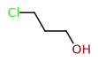
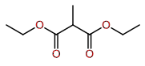
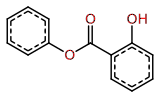
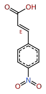
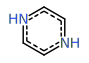
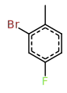
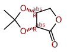
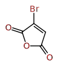

## 10_Beginner

| Exercise | Correction |
|----------|------------|
| 01 |  |
| 03 |  |
| 07 |  |
| 14 |  |
| 27 |  |
| 29 |  |
| 30 |  |
| 33 |  |
| 40 |  |
| 46 |  |
| 50 |  |
| 62 |  |
| 64 |  |

## 20_Intermediate

| Exercise | Correction |
|----------|------------|
| 02 |  |
| 04 |  |
| 05 |  |
| 09 |  |
| 11 |  |
| 12 |  |
| 15 |  |
| 16 |  |
| 17 |  |
| 19 |  |
| 20 |  |
| 21 |  |
| 23 |  |
| 24 |  |
| 25 |  |
| 26 |  |
| 28 |  |
| 31 |  |
| 32 |  |
| 34 |  |
| 35 |  |
| 36 |  |
| 37 |  |
| 39 |  |
| 42 |  |
| 43 |  |
| 44 |  |
| 45 |  |
| 47 |  |
| 49 |  |
| 52 |  |
| 53 |  |
| 55 |  |
| 56 |  |
| 57 |  |
| 59 |  |
| 61 |  |
| 63 |  |

## 30_Advanced

| Exercise | Correction |
|----------|------------|
| 06 |  |
| 08 |  |
| 10 |  |
| 13 |  |
| 18 |  |
| 22 |  |
| 38 |  |
| 41 |  |
| 48 |  |
| 51 |  |
| 54 |  |
| 58 |  |
| 60 |  |